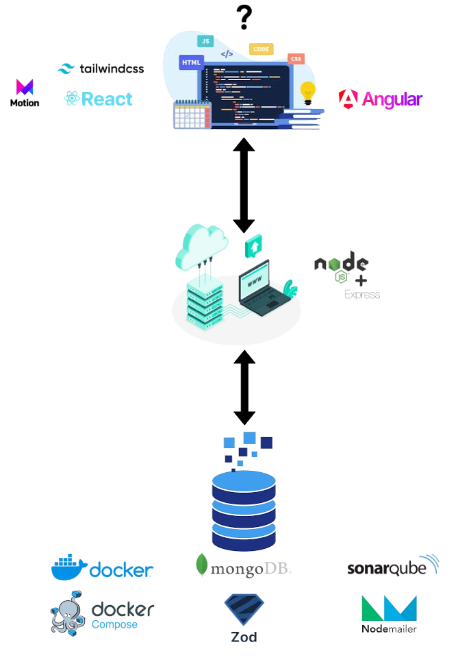

# Proyecto TFG - Backend

Este proyecto es la parte backend de una aplicación de comercio electrónico. A continuación se describe la estructura del proyecto y la funcionalidad de cada archivo.

## Estructura del Proyecto

### ⚙️ Configuración y Carga Inicial

- **src/config.js**: Configuración de variables de entorno.
- **src/loaders/index.js**: Inicializa las cargas de Express y la base de datos.
- **src/loaders/express.js**: Configura Express, incluyendo middlewares y rutas.
- **src/loaders/db.js**: Conexión a la base de datos MongoDB.

### 🗂️ Modelos

- **src/models/userModel.js**: Esquema y modelo de usuario.
- **src/models/proveedorModel.js**: Esquema y modelo de proveedor.
- **src/models/productModel.js**: Esquema y modelo de producto.
- **src/models/orderModel.js**: Esquema y modelo de orden.
- **src/models/cartModel.js**: Esquema y modelo de carrito de compras.
- **src/models/reviewModel.js**: Esquema y modelo de reseña.
- **src/models/shippingAddressModel.js**: Esquema y modelo de dirección de envío.
- **src/models/purchaseHistoryModel.js**: Esquema y modelo de historial de compras.
- **src/models/eventModel.js**: Esquema y modelo de evento.
- **src/models/inventoryModel.js**: Esquema y modelo de inventario.
- **src/models/favoriteShoesModel.js**: Esquema y modelo de zapatos favoritos.
- **src/models/categoryModel.js**: Esquema y modelo de categoría.

### 🛠️ Controladores

- **src/controllers/authController.js**: Controlador para autenticación y gestión de usuarios.
- **src/controllers/productController.js**: Controlador para gestión de productos.
- **src/controllers/cartController.js**: Controlador para gestión de carritos de compras.
- **src/controllers/eventController.js**: Controlador para gestión de eventos.

### 🌐 Rutas

- **src/routes/authRoutes.js**: Rutas de autenticación.
- **src/routes/productRoutes.js**: Rutas de productos.
- **src/routes/cartRoutes.js**: Rutas de carritos de compras.
- **src/routes/eventRoutes.js**: Rutas de eventos.
- **src/routes/indexRoutes.js**: Archivo principal de rutas que importa y usa todas las rutas anteriores.

### ✅ Esquemas de Validación

- **src/schemas/registerSchema.js**: Esquema de validación para registro de usuarios.
- **src/schemas/loginSchema.js**: Esquema de validación para inicio de sesión.
- **src/schemas/createProductSchema.js**: Esquema de validación para creación de productos.
- **src/schemas/updateProductSchema.js**: Esquema de validación para actualización de productos.
- **src/schemas/voteProductSchema.js**: Esquema de validación para votación de productos.
- **src/schemas/addToCartSchema.js**: Esquema de validación para añadir productos al carrito.
- **src/schemas/swaggerSchemas.js**: Esquemas para la documentación Swagger.

### 🔒 Middlewares

- **src/middlewares/validateSchema.js**: Middleware para validar esquemas.
- **src/middlewares/isProveedor.js**: Middleware para verificar si el usuario es proveedor.
- **src/middlewares/isAdmin.js**: Middleware para verificar si el usuario es administrador.
- **src/middlewares/loggerMiddleware.js**: Middleware para registrar logs.
- **src/middlewares/errorHandlingMiddleware.js**: Middleware para manejar errores.

### 🔧 Utilidades

- **src/utils/logger.js**: Configuración del logger.

### 📄 Documentación

- **src/config/swagger.js**: Configuración de Swagger para la documentación de la API.

### 🚀 Inicialización

- **src/index.js**: Punto de entrada de la aplicación.
- **src/app.js**: Configuración de la aplicación Express.

## Funcionamiento

El proyecto está estructurado para manejar un sistema de comercio electrónico con autenticación de usuarios, gestión de productos, carritos de compras, eventos y más. Utiliza MongoDB como base de datos y Express como framework de servidor.

Para más detalles sobre la estructura y funcionamiento, puedes consultar la [documentación Swagger](http://localhost:4000/api-docs).

## 🛠️ Tecnologías Utilizadas

- **Node.js**: Entorno de ejecución para JavaScript en el servidor.
- **Express**: Framework web para Node.js, utilizado para construir la API REST.
- **MongoDB**: Base de datos NoSQL utilizada para almacenar datos.
- **Mongoose**: Biblioteca de modelado de datos para MongoDB y Node.js.
- **Zod**: Biblioteca de validación de esquemas para validar datos de entrada.
- **JWT (JSON Web Tokens)**: Utilizado para la autenticación y autorización de usuarios.
- **Swagger**: Herramienta para documentar la API REST.
- **bcrypt**: Biblioteca para el hashing de contraseñas.
- **dotenv**: Carga variables de entorno desde un archivo `.env`.
- **crypto**: Módulo de Node.js para operaciones criptográficas.
- **nodemailer**: Biblioteca para enviar correos electrónicos desde Node.js.

